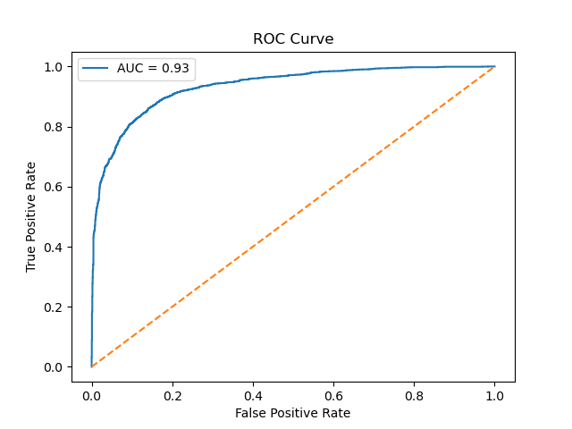
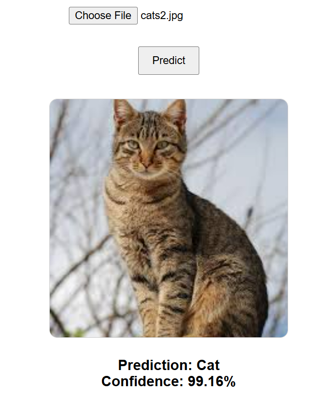

Cats vs Dogs Image Classification ML App

A production-ready Deep Learning web application that classifies images of cats and dogs using a custom Convolutional Neural Network (CNN).

Live Demo:
https://dogs-cats-classifier-ztd3.onrender.com

The trained model is exposed through a FastAPI backend and hosted on Render, allowing users to upload images through a web interface and receive real-time predictions.

#Project Overview

This project demonstrates the complete Deep Learning lifecycle:

Reproducible dataset loading
tf.data input pipeline
Data preprocessing outside model for separation of concerns
Data augmentation
CNN model training
Model persistence
FastAPI deployment
Interactive browser UI
Performance evaluation & visualization

#Dataset
Cats vs Dogs Filtered Dataset
12,499 images each class
Binary classification
Balanced classes
Image data (.jpg format)

Dataset includes:
cats
dogs

The dataset is not included in this repository (excluded via .gitignore due to size constraints).  
Only the trained model, hosted on Google Drive, is required for inference.

Download the trained model here:

https://www.kaggle.com/datasets/bhavikjikadara/dog-and-cat-classification-dataset?resource=download

After extraction and cleaning:

data/
└── cats_and_dogs/
    ├── train/
    │   ├── cats/
    │   └── dogs/
    │
    ├── validation/
        ├── cats/
        └── dogs/

Ideal for:
Fast training
Custom CNN experimentation
Deep learning workflow demonstration
Deep Learning Pipeline

Built using TensorFlow + tf.data

#Data Loading

Directory-based image loading
Mini-batch processing
Efficient dataset caching
Prefetch optimization

#Data Preprocessing

Images resized to 160×160  
Pixel values normalized to [0,1] by dividing by 255  
Data augmentation applied during training (random flips, rotations, and zooms.)  
Dataset loaded using a mini-batch pipeline  
Disk caching and prefetching enabled for faster training

Data augmentation applied during training to improve model generalization.

#Model Architecture

Baseline CNN:

Input (160×160×3)

Conv2D (32 filters)
MaxPooling

Conv2D (64 filters)
MaxPooling

Conv2D (128 filters)
MaxPooling

GlobalAveragePooling

Dense (128 units)

Dropout (0.5)

Dense (1 unit, Sigmoid)

GlobalAveragePooling used instead of Flatten to reduce model parameters and improve generalization.

Parameter Configuration
Optimizer: Adam (lr=Scheduled, 0.0001 and 0.00005)
Loss Function: Binary Cross Entropy
Batch Size: 32
Input Shape: 160X160X3
Regularization: Dropout (0.5), Early Stopping (Patience=5)
Learning Rate Schedule: ReduceLROnPlateau (Factor=0.5, Patience=3)

Training includes:

EarlyStopping
ModelCheckpoint
ReduceLROnPlateau

#Model Evaluation

Evaluation artifacts are saved to:

assets/

Generated outputs:

accuracy_curve.png
loss_curve.png
confusion_matrix.png
classification_report.txt
roc_curve.png

These visualize:

Training behavior
Model learning stability
Classification performance
Prediction reliability

#Current Performance
Model Performance:
Validation Accuracy: 86%

AUC Score: 0.93

#Model Persistence

Saved artifacts:

models/

best_model.keras
final_model.keras

logs/training_log.csv

Where:

best_model.keras → Best validation model  
final_model.keras → Final trained model  
training_log.csv → Training history  

Inference is fast due to:

• Lightweight CNN architecture
• Optimized image preprocessing pipeline
• Small input image size (160×160 pixels)

Training efficiency is improved through:

• Mini-batch loading
• Dataset disk caching
• Prefetching for improved I/O performance

#Web Application

Backend:
FastAPI
REST prediction endpoint

Frontend:
HTML
CSS
JavaScript (async fetch)

Features:
Image upload
Live preview
Real-time prediction
Probability output

Example output:

Prediction: Cat  
Probability: 99.16%

#Installation & Usage

Install dependencies:

pip install -r requirements.txt

Run train using script:

python -m src.train.py

Run FastAPI server:

uvicorn api:app --reload

Open browser:

http://127.0.0.1:8000

Upload an image to test predictions.

#Tech Stack

Backend:
Python
TensorFlow/Keras
FastAPI

Frontend:
HTML
CSS
JavaScript

Libraries:
TensorFlow
FastAPI
NumPy
Matplotlib
Scikit-learn
Pillow
Uvicorn

Deployment:
Render

#Key Engineering Skills Demonstrated
Custom CNN model development
tf.data pipeline engineering
Data resizing and normalization techniques
Data augmentation techniques
Learning curve visualization
Model evaluation metrics and code debugging (model fine-tuning)
API deployment
Frontend/backend integration
Production-ready project structure

#Project Structure
dogs_cats_classifier/

data/
notebooks/
src/

templates/
static/

models/
assets/

api.py
README.md
requirements.txt

#Future Improvements

Planned upgrades:

Transfer Learning (MobileNetV2)
EfficientNet implementation
Docker containerization
GPU training optimization
Cloud deployment scaling
Add multi-class animal classification support  
Integrate model performance monitoring

#Author

Adeleye Babatunde

